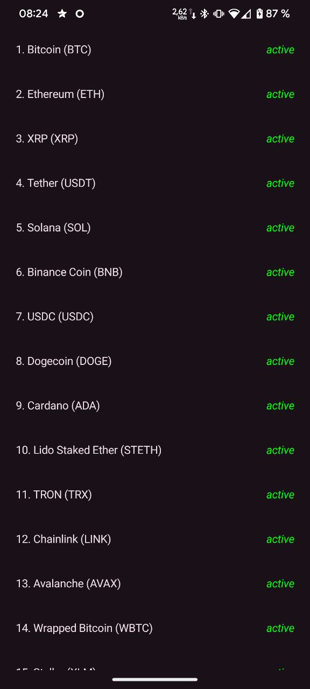
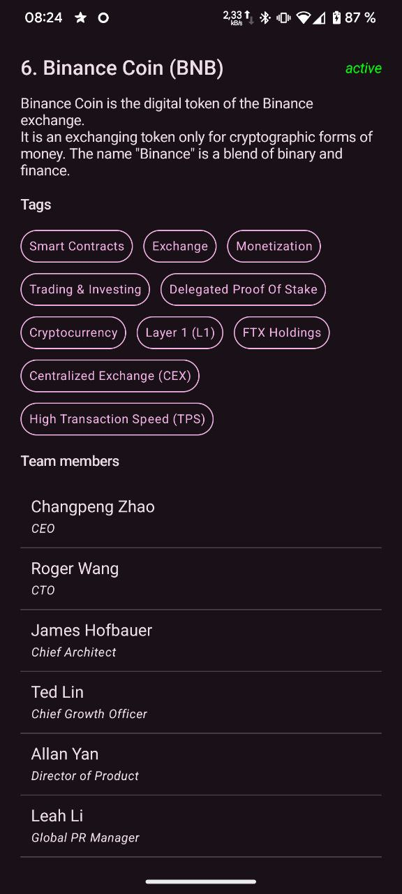

# Crypto Tracker 🚀

[](https://kotlinlang.org)
[](https://developer.android.com)

Приложение для отслеживания криптовалют с использованием CoinPaprika API. Позволяет просматривать базовую информацию о криптовалютах и их детальные характеристики.

<p align="center">
  
  
</p>

## Основные функции 🌟
- 📋 Список криптовалют с базовой информацией:
    - Название и символ
    - Рейтинг (позиция в топе)
    - Статус активности
    - Тип (монета/токен)
    - Новизна (добавлено менее 5 дней назад)
- 🔍 Детальная информация о криптовалюте

## Технологии 🛠️
- **Язык:** Kotlin
- **Архитектура:** Clean Architecture (Data + Domain + Presentation)
- **UI:** Jetpack Compose
- **Сеть:** Retrofit
- **Асинхронность:** Coroutines + Flow
- **DI:** Hilt
- **Кеширование:** Custom CoinCache

## API 📡
Используется [CoinPaprika API](https://api.coinpaprika.com):
- `GET /coins` - список криптовалют
- `GET /coins/{id}` - детали криптовалюты
- Авторизация не требуется

## Установка ⚙️
1. Клонируйте репозиторий:
```bash
git clone https://github.com/your-username/crypto-tracker.git
```
2. Откройте проект в Android Studio
3. Запустите приложение на эмуляторе или устройстве

## Архитектура 🏗️
Проект построен на основе Clean Architecture:
```
app/
├── data/       # Слой данных (API, кеш)
├── domain/     # Бизнес-логика (UseCases, модели)
└── presentation/ # UI (Compose, ViewModel)
```
